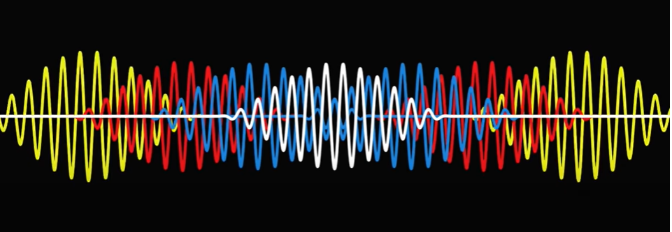
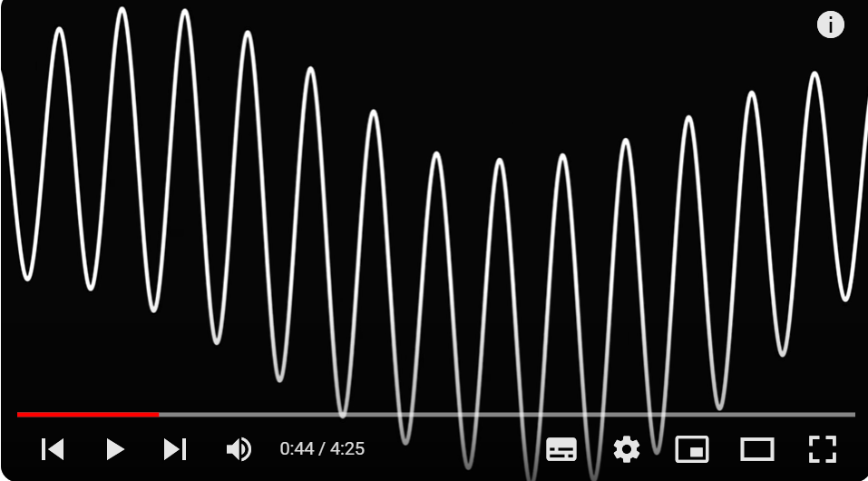
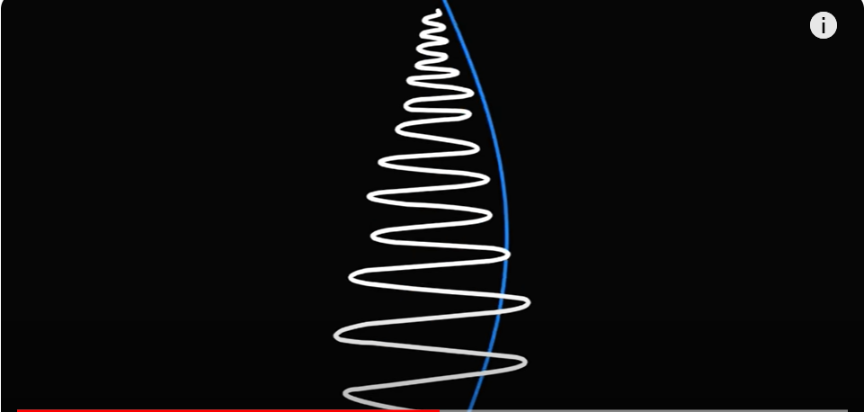
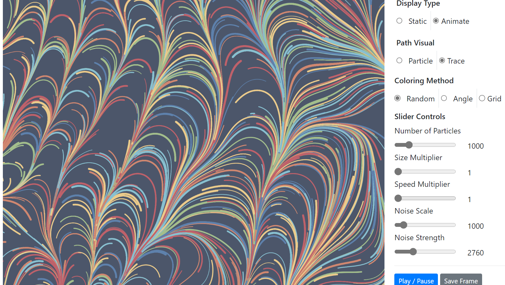

# hzha0309_9103_quiz8

## Part1
This example was chosen for the audio method of our individual animation task. It combines the waveform and some drawings to match the content of the song “Do I Wanna Know?”. The waveform not only shows the frequency of the music, each waveform also shows different parts. For my project, I'd like to incorporate its waveform change with the frequency of the audio. I could use this technique to animate either the whole artwork (e.g. "Broadway Boogie Woogie"); or the primary part (e.g. "Apple Tree"); or the background (e.g. "The Scream"), make them wave to visualize the music.

### Screenshots for imaging technique

### Link of imaging technique
#### [Link of sound visualization](https://www.youtube.com/watch?v=bpOSxM0rNPM&list=PLsDImNeiC2I1A1JEVefoEMg7OivaLzUHz&index=15)

## Part2
The waves this coding operates is not about the sound frequency but the noise strength, it could contribute to my desired effect. This project implemented the animation by creating particle animation, and records the movements. To help achieve my design, after capture and analyze sound, and get frequency information, we could modify particle animation to use the sound data obtained from the audio analysis by adjusting the color, movements, size, or other parameters to modify visualization. This allows it to react and visualize sound frequencies, amplitudes, or other audio characteristics in real-time.

### Screenshot for coding technique in action

### Link of implementation
#### [Link to example implementation](https://vharivinay.github.io/Flow-field-using-noise/)
#### [Link to example code](https://github.com/vharivinay/Flow-field-using-noise.git)